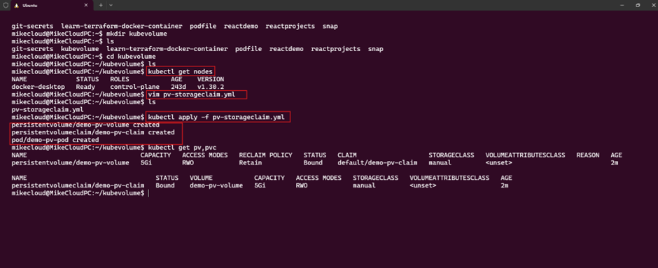
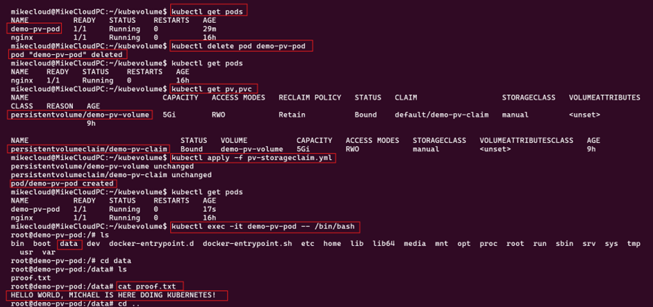
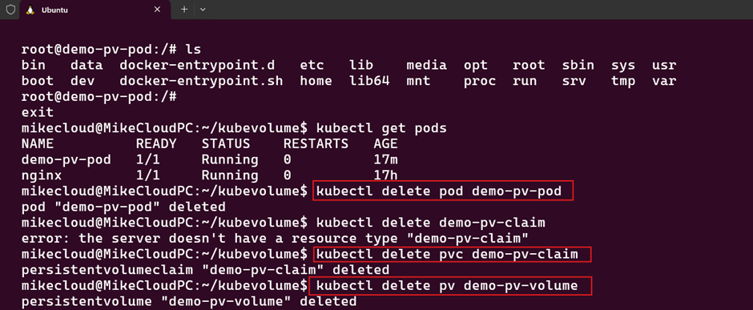

# Configure a Pod to Use a PersistentVolume for Storage.

A simple demo of PV and PVC using docker-desktop with K8s cluster installed

Apply the file using kubectl command

follow the step by step screenshot 
The file will provission: 
- Persistentvolume/demo-pv-volume
- persistentvolumeclaim/demo-pv-claim
- pod/demo-pv-pod 

The volume will be mounted to a hostpath persistentVolume with a capacity of 5Gi for testing, using storageClass "Manual"

# After deployment, Proof...

After a successful deployment, login to the pod using kubectl exec command and create a .txt file to test the PersistenVolumeClaim
- See screenshot

# Clean up

- delete the Pod, pv, pvc and the path.
- See screenshot

