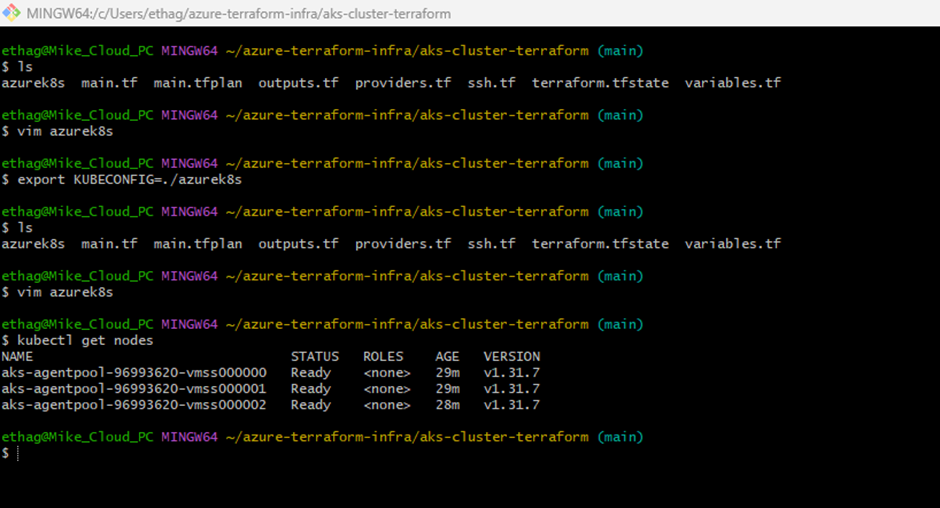
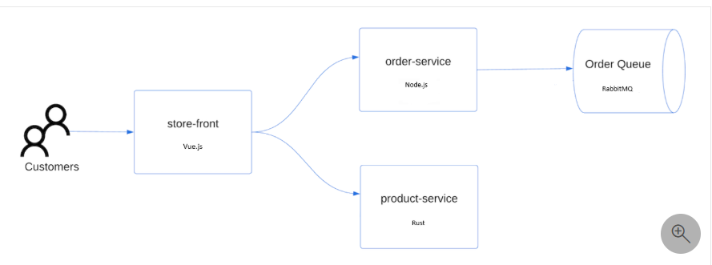
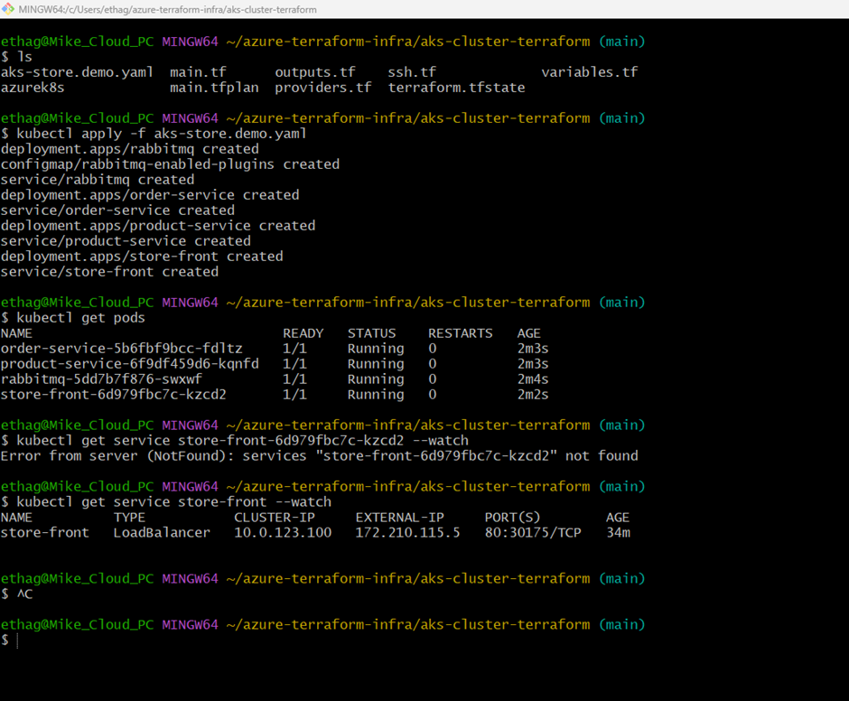
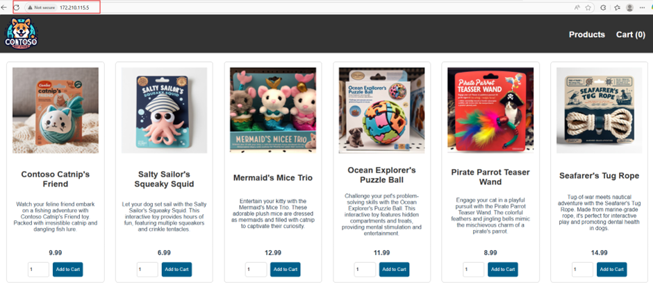

DEMO: Deploy an Azure Kubernetes Service Cluster Using Terraform

Azure Kubernetes Service (AKS) is a Microsoft managed kubernetes service that lets you quickly deploy and manage cluster.

This demo code deployed an AKS cluster using Terraform and also run a sample multi-container app with a group of microservices and web front end to simulate a retail services.

Requirements:
- Azure account with active subscription and the neccessary privilege
- Install and configure Terraform
- Download kubectl
- Azure cli
- Vscode or
- Bash terminal

The code will create the following:
- a random value for the Azure resource group name using random_pet, # you can change it to suit your naming convention
- an Azure resource group using azurerm_resource_group
- Access the configuration of the AzureRM provider to get the Azure Object ID using azurerm_client_config
- kubernetes cluster using azurerm_kubernetes_cluster
- an AzAPI resource azapi_resource
- an AzAPI resource to generate an SSH key pair using azapi_resource_action

Deploying the code, you need to login to Azure and authenticate using Azure cli and then run the following commands accordingly

Terraform command to deploy the infra code...

- terraform init -upgrade                   # Initialize terraform, The -upgrade parameter upgrades the necessary provider plugins to the newest version that complies with the configuration's version constraints
- terraform plan -out main.tfplan           # create an execution plan, The optional -out parameter allows you to specify an output file for the plan. Using the -out parameter ensures that the plan you reviewed is exactly what is applied.
- terraform apply main.tfplan               # Apply the execution plan,  Note: If you didn't use the -out parameter, call terraform apply without any parameters.

- The deployment will output the following if successful:
client_certificate           = <sensitive>
client_key                   = <sensitive>
cluster_ca_certificate       = <sensitive>
cluster_password             = <sensitive>
cluster_username             = <sensitive>
host = <sensitive>
key data                     = ""
kube_config                  = <sensitive>
kubernetes_cluster_name      = ""
resource_group_name          = ""

echo "$(terraform output kube_config)" > ./azurek8s              # After the output verifications, use this command to get the k8s configuration from the Terraform state and store it in a file that kubectl can read.

using <vim azurek8s> to varify the ASCII EOT from Bash terminal and edit the file. { If you see << EOT at the beginning and EOT at the end, remove these characters from the file. Otherwise, you may receive the following error message: error: error loading config file "azurek8s": yaml: mapping values are not allowed in this context } Then save esc:wq 

export KUBECONFIG=./azurek8s                                    # set an environment variable for kubectl to pick the correct configuration by using this command

Verify the health of the cluster using the <kubectl get nodes> command

Deploy the Application using the kubectl apply command and specify the name of your YAML manifest

Store front: Web application for customers to view products and place orders.
Product service: Shows product information.
Order service: Places orders.
Rabbit MQ: Message queue for an order queue.

Credit to Microsoft Docs

Test the application, first run <kubectl get pods> to check the status of the pods and then run <kubectl get service store-front --watch> to get the EXTERNAL IP

That's it!!!

### When you are done, don't forget to clean up resources provisioned by Terraform.

1. run <terraform plan -destroy -out main.destroy.tfplan> 
2. run <terraform apply main.destroy.tfplan>
3. Delete service principal <az ad sp delete --id $sp>

I will also implement the CICD pipeline for this project using Azure DevOps!

Let me know if there's any query.

